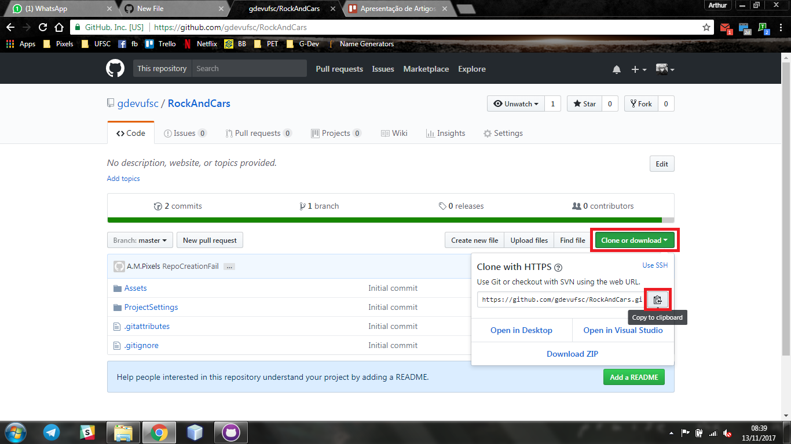
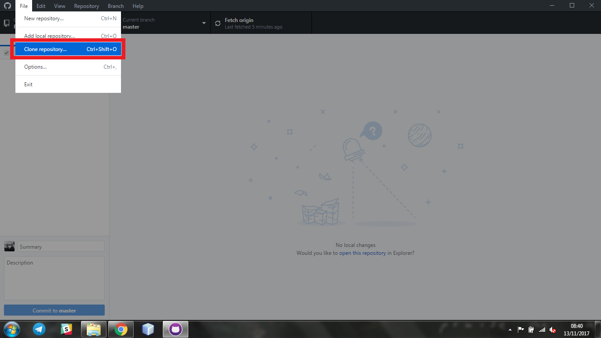
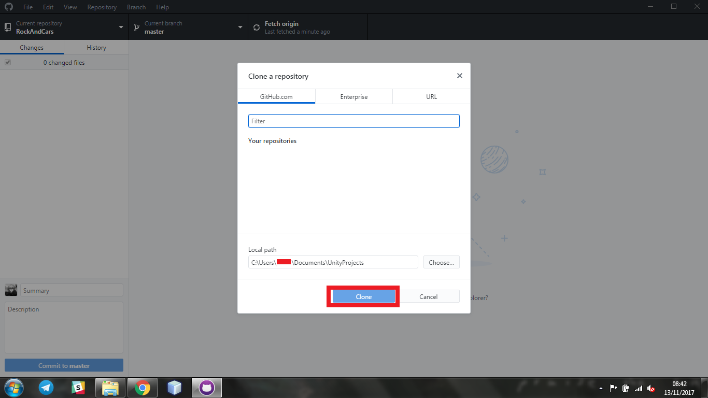

Windows
=======

**Foto do chat**:

Foto do chat no episódio em questão

**Foto do chat**:

Foto do chat no episódio em questão

**Foto do chat**:

Foto do chat no episódio em questão

**Foto do chat**:

Foto do chat no episódio em questão
