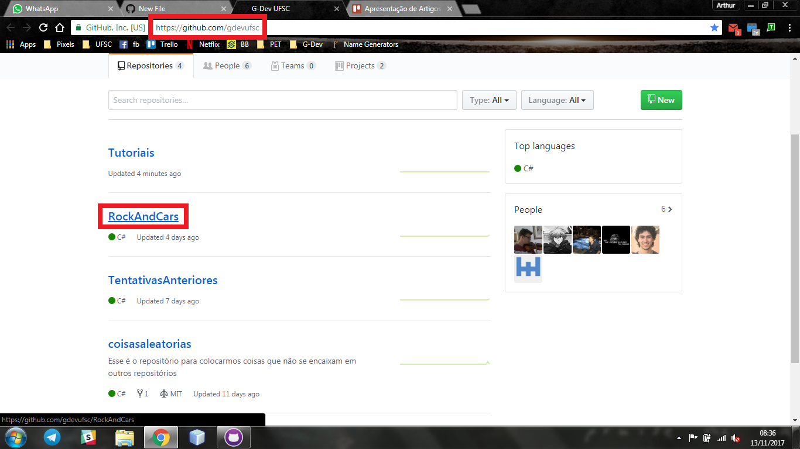

Windows
=======

1. https://desktop.github.com/

**Foto do chat**:

Foto do chat no episódio em questão

**Foto do chat**:

Foto do chat no episódio em questão

**Foto do chat**:

Foto do chat no episódio em questão

**Foto do chat**:

Foto do chat no episódio em questão
